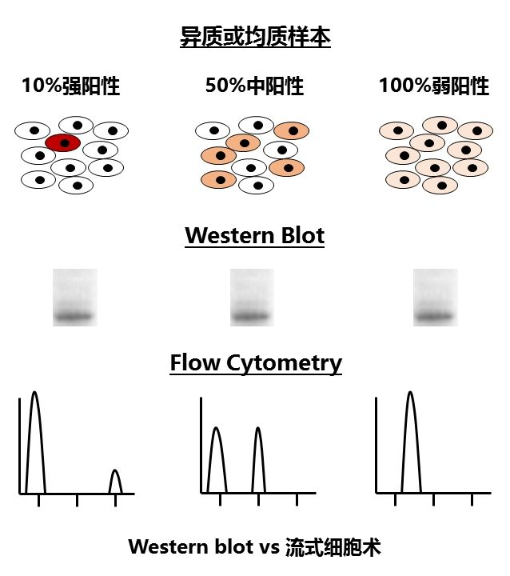

# Why
- _**为什么开始这个文档呢？**_ 始于git的约定，为了更好的督促学习和get新的知识，我都会认真去读小伙伴写的帖子，有时候有疑问、有时候为了跟上思路需要自己去补充基本知识、有时候发现有些很好的东西以后会用到……反正基于这些点，我觉得需要集中记录一下，然后有空的时候可以review看看强化，所以……

# What
- _**那么在这个文档里有什么呢？**_ 笔记咯~

# Who

- _**Susu, start at 05/19**_  

---

## CNV 背景介绍

【[原始的文献来源：# Computational tools for copy number variation (CNV) detection using next-generation sequencing data: features and perspectives](https://bmcbioinformatics.biomedcentral.com/articles/10.1186/1471-2105-14-S11-S1)】
### variants种类：
Genomic variation is comprised of single nucleotide variants (SNVs), small insertions or deletions (indels), copy number variations (CNVs), and large structural variants (SVs); these variants range from single base changes to large chromosomal-level alterations [[1](https://bmcbioinformatics.biomedcentral.com/articles/10.1186/1471-2105-14-S11-S1#CR1)]

### CNV定义：
- 文章原文：CNV refers to a type of intermediate-scale SVs with copy number changes involving a DNA fragment that is typically greater than one kilobases (Kb) and less than five megabases (Mb) [[2](https://bmcbioinformatics.biomedcentral.com/articles/10.1186/1471-2105-14-S11-S1#CR2)].
- 百度百科：拷贝数目变异（拷贝数变异，CNV）也称拷贝数目多态（拷贝数多态性，CNP），是一种大小介于1 KB至3 MB的DNA片段的变异，在人类基因组中广泛分布其覆盖的核苷酸总数大大超过单核苷酸多态性（单核苷酸多态性，SNP）位点的总数，并就CNV在动物基因组中的研究进行了展望。

### 传统的CNV检测方式：
employs cytogenetic technologies, such as karyotyping and fluorescence _in situ_ hybridization (FISH) [[9](https://bmcbioinformatics.biomedcentral.com/articles/10.1186/1471-2105-14-S11-S1#CR9)].
细胞遗传学技术，如核型分析和荧光原位杂交FISH

### 技术发展后的CNV检测方式：
随着芯片和测序技术的发展，逐渐发展出了不同的工具（基于不同的算法原理）用于鉴别CNV，这篇综述主要呈现了37种工具的检测策略，共可以归纳为：通过NGS数据鉴定CNV的5种策略——paired-end mapping (PEM), (2) split read (SR), (3) read depth (RD), (4) _de novo_ assembly of a genome (AS), and (5) combination of the above approaches (CB)。

### 目前我们在使用的检测CNV的方式为：
- GATK（最终使用的）；
- CNVkit（尝试过的，但没有最终使用）；

### call CNV的原理：
call CNV的方法就是通过基因组不同区域的Read Depth数来确定，但是具体用了的统计学模型看不懂

知乎上看了一个帖子：CNV因为绝大部分是打在noncoding区上的，而WES测序的方式是noncoding区的信息丢失；其次，WES在捕获过程中，探针可能会对序列有偏好性，导致reads的覆盖度的波动非常大，而这些波动很容易被误判为CNV，所以假阳性特别高。因此针对不同的测序方式要选择合适的算法才可以准确的call 出CNV。

### call CNV的工具：
- CNVkit, 2014年发表在_PLOS Computational Biology_杂志上：
	- [official website](http://cnvkit.readthedocs.io/en/stable/)
	- [生信菜鸟团](http://www.bio-info-trainee.com/2859.html)，但我看这个链接上写的cnvkit主要是对肿瘤配对样本的wes来寻找cnv啊，所以我们服务器上也用这个，合适么？

---
## 统计相关
“三种常用的误差线，标准差（s.d.），标准误（s.e.m）还有置信区间（CI）”，我以前只知道：标准差和标准误这两个。有一个疑问是，既然文章对比了有差别，那么这3种描述误差线的指标分别在什么情况下使用更合适呢？

样本和总体之间的一些参数对比：

---
## 第六届数学、计算机与生命科学交叉研究青年学者论坛会议summary

今天去参加了一年一度的“第六届数学、计算机与生命科学交叉研究青年学者论坛”，感触也很多，最大的不同是发现终于很多东西我能听懂了……科研也是一个圈子，大腿抱大腿，需要不断的参加这种学术会议来更新自己的知识体系，以及借鉴别人优秀的东西。虽然全程困啊困啊，但是现在想想无数个想放弃的瞬间却最终坚持下来了依然是有收获的，因为整理了一下这几天的东西还蛮有收获的：

1.一些在招博士后的最一手的信息；
- [西安交通大学叶凯](http://info.xjtu.edu.cn/info/1019/20468.htm)
- [同济大学张勇-长期有效](http://life.tongji.edu.cn/Data/View/372)
- [UCLA-邢毅](https://github.com/Xinglab/Xinglab.github.io)
- [中山大学-骆观正](http://lifesciences.sysu.edu.cn/zh-hans/node/258)
- [北京大学-张泽民](http://cancer-pku.cn/index.php/positions/pd1/)

2.发现做蛋白结构预测的人还挺多的，这些学者的研究是更深入的，会去从生物学的背景、要阐释的科学问题的角度出发，而不是直接停留在机器学习的算法层面。之前我的认知一直觉得还蛮简单的，现在想想真是够肤浅了。ppt里有一些好的片子如果后续研究相关的内容可以借鉴。

3.偶然听到一个老师讲从GWAS结果和PPI后的基因间的上位显性作用出发来进行科学问题的解释，感觉对之前药物靶点的那个问题豁然开朗，所以真的是要经常听听别人讲才会有更好的科研进展。相关PPT的文献在endnote里已经找到。

4.很多研究者都在关注科学的前沿，追踪最新的文献动态，其实也只有这样才能做出漂亮的东西~所以看文献啊看文献，哈哈哈！

5.下面记录的就是一些被扫盲的内容了，好多前沿的概念、技术方法第一次听说，回来自己又查了查，涨知识了。

**DARTS DNN 预测可变剪接：** Deep-learning Augmented RNA-seq analysis of Transcript Splicing
[Xinglab DARTS website](https://github.com/Xinglab/DARTS)，看了下这个安装应该不是特别复杂，而且是基于python环境的，刚好也是机器学习相关的内容。产生了一个想法，是否可以用RNAseq的那批数据做一个测试看看能否鉴别出可变剪切，mark一下，后续进行一个尝试。

**表观遗传优质文章ppt：** 之前给boss做ppt的时候关于表观遗传这块一直无法找到特别好的素材、文献也不是特别有代表性，刚好这次会议有大牛介绍了相关的内容，ppt很不错，如果后续需要用到可以参考下上面相关的素材。

**RNA甲基化：MeRIP-seq** 
也是通过这个会议才了解到原来RNA还有甲基化呢，扫盲了。**什么是RNA甲基化？** RNA甲基化指发生在RNA分子上不同位置的甲基化修饰现象，常见的RNA转录后修饰方式有6-甲基腺嘌呤(N6-methyladenosine，m6A) 和5-甲基胞嘧啶(C5-methylcytidine，m5C)等。最新研究发现，m6A修饰在调控基因表达、剪接、RNA 编辑、RNA 稳定性、控制mRNA寿命和降解、介导环状RNA翻译等方面扮演重要角色。因此meRIP-seq助力解决细胞分化，生物发育、疾病发生发展，热休克反应等生物学问题。利用甲基化RNA免疫共沉淀结合高通量测序 (Methylated RNA Immunoprecipitation sequening，MeRIP-seq)技术，可以对RNA转录后甲基化修饰图谱进行全面研究，是表观转录组学研究的关键技术。这部分内容是**中山大学的骆观正**讲的，最后致谢的时候他提到了**易汉博基因科技的陈同**，然后就感慨，世界真小，生信的圈子也就这么大……

**allele specific expression (ASE)** 等位基因特异性表达（ASE）是癌症的重要特征之一，这个概念还真是第一次听说，虽然也没太懂啥意思吧。

**Gene Expression Profiling Interactive Analysis** 
这个工具首有的手机APP，然后是网页版的工具。页面做的很炫，但是只能做癌症相关数据的分析，因为她们的数据来源就是TCGA和GTEx，那这种思路其实在精神疾病中也是有应用的，而且蛮多的。
- GE-mini: a mobile APP for large-scale gene expression visualization
- [Gene Expression Profiling Interactive Analysis](http://gepia.cancer-pku.cn/index.html)

**3Disease Browser** 
一个很有意思的内容，a web server for human 3D genome structure and disease associated CR events，那么CR是指是呢？Chromosomal rearrangement (CR) event may disrupt genes and other functional structures. 其实CR就是染色体的重排。在网站上对几个**精神疾病**进行检索，结果挺有意思的，像SZ的结果记录很少，还没有ADHD的多，以及结果也不如ADHD的显著，不知道是因为数据没有收录，还是说现有发现没有对应的比较好的结果：Attention deficit hyperactivity disorder，最显著的P值是0.004692737。但是里面没有关于PTSD的疾病记录。[3D browser website](http://3dgb.cbi.pku.edu.cn/disease/) 看了下李程老师当时的ppt，这个server是有对应的文章的，如果后续有时间找来看看数据收录方式就知道是怎么回事了。

**参加会议的时候别人分享了一个工具，call SV的工具：**
- MetaSV: an accurate and integrative structural-variant caller for next generation sequencing
- [对应的github website](http://bioinform.github.io/metasv/)
ps：偶然发现这个团队对应的GitHub的仓储下也有RNACocktail那个，所以不知道是不是一个团队开发的，以及貌似这个团队是Roche？先Mark，如果以后需要call SV可以尝试。

ppt里还有一些跟大数据、遗传变异等内容相关的ppt，文献也都下载了，但目前不知道怎么加到我的ppt里，今天先记录到这里，后续有更新再补充吧。
[Image by J.Oksenberg/UCSF](https://www.ucsf.edu/news/2011/08/10431/major-genetic-study-multiple-sclerosis-reveals-dna-hot-spots-disease)

---
## 宏基因组 & 进化树

写这部分内容的起因是需要帮Ma bo那边调研一下MEGA这个软件怎么用，原以为应该是特别简单的一个做进化的软件，但我一查发现还有点复杂啊，以及现在很多做宏基因组的人用这个比较多，然后想做好进化树也是需要很多背景知识的，所以就在学习的过程中写写关键信息。

**但提醒自己这个只是一个扩充知识的过程，不要弄太细……没那么多时间！所以比如要做到的程度是：哪个地方需要选模型；首先需要提供什么数据；……而不是去告诉她该怎么选择模型，目前时间有限且掌握的内容有限，一定要有侧重！**

- [科普帖子—宏基因组——生信技能树](www.biotrainee.com/thread-157-1-1.html)
- [科普帖子—系统进化树基本知识——生信技能树](http://www.biotrainee.com/thread-1521-1-1.html)

因为具体也不知道mabo那边到底要干嘛，也没告诉我具体的事情，明天下午就抽时间看看[说明文档](https://www.megasoftware.net/web_help_7/helpfile.htm#hc_first_time_user.htm)就好了

--- 
## Variant 分析
### 什么是遗传变异？
所谓的遗传变异就是生物体内遗传物质发生变化而产生的可以遗传给后代的变异，生物体内的这些变异导致了生物体在不同水平上体现出遗传多样性。生物信息学中各种基因组学就是对这些遗传变异进行研究。

### 遗传变异的类型
常见的就是哪几种类型，区分的简单原则就是有几个位点改变了：SNP是单个核苷酸的改变，indel通常是50bp以下的变异，SV和CNV则要更长。（SNP 和 SNV 都是单碱基的突变，但是SNP 是多了一个频率属性的SNV，比如在群体中1%以上。）

- Synonymous SNP：如果SNP发生在编码区，根据密码子简并性 SNP 不一定会引起编码氨基酸的改变，不引起任何变化的叫做Synonymous SNP。
- Non-Synonymous SNP：引起氨基酸变化的叫做Non-Synonymous SNP。
- 错义突变：如果编码的某种氨基酸的密码子变成另一种，会导致多肽链的氨基酸种类和序列发生改变，这就是一个错义突变。
- 无义突变：当突变使一个编码氨基酸的密码子变成终止子时，则蛋白质合成进行到该突变位点时会提前终止，这时就是无义突变。

### 检验遗传变异的原理
基于高通量数据中的reads在某个位点上的碱基，同时结合概率分布、统计等进行检验。基因组结构变异的检测主要有4种思路（我看到这就想起来CYL之前写的那个帖子了，就又回去翻了翻，发现这里其实漏了一个组合的检测思路，所以实际应该是5种）：
- 双端 reads 连配 (pair-end mehtod)：首先进行mapping，然后评价双端reads的方向信息和距离是否与建库结果一致；
- reads 覆盖深度 (read-depth method)：多用于检测拷贝数变异，假设比对到基因组的覆盖深度符合泊松分布，然后检测与该分布不一致的区域。
- reads 分割法 (split-read)：首先保证双端的一个read 可以完整的唯一比对，然后把另一条read进行拆分再去进行比对。
- 从头组装 (assembly)：啥也不管直接拼，拼完了再去和参考基因组比对。

_**ps：其实我还是不太懂具体原理是啥，但至少是2次刷新对CNV检测原理的印象了，至少这次我能反应起来是有人写过帖子，知道去对比下是不是一样的~ 这就是积累的过程！**_

### 转换（Transition）和颠换（Transversion）
转换(transition)则是嘌呤被嘌呤，或嘧啶被嘧啶替代，颠换(transversion)是指嘌呤与嘧啶的变化。转换突变比颠换突变更常见，且与颠换相比在氨基酸序列上产生差异的可能性更低。一般Transition 是 Transversion 数量的2倍。

---

## Gene Ontology (GO)注释

**为什么要写这个呢？** 最近在弄中期答辩相关的东西，就在研究**怎么阐释找到的疾病相关的基因、通路的生物学意义，比如我们经常会用到GO,KEGG,Reactome注释，但具体这些注释什么用？我一直是了解的很浅显和片面的，以及怎么用这些内容去讲一个生物学的故事？伴随着这些问题吧，就开始了探索。** 然后看到有前辈用QuickGo对GO的结果进行图片展示，类似如下的图：

所以我也开始研究QuickGO。

**首先，**[PLoB关于GO的介绍](https://www.plob.org/article/3825.html)还挺详细的，但是吧，有点绕，可能我读的太糙。简单来说呢，GO提供了三种注释：
- Molecular Function，分子功能（基因产物个体的功能，如与碳水化合物结合或ATP水解酶活性等）  
- Cellular Component，细胞组成（亚细胞结构、位置和大分子复合物，如核仁、端粒和识别起始的复合物等）
- Biological Process，生物学途径（分子功能的有序组合，达成更广的生物功能，如有丝分裂或嘌呤代谢等）

_**ps: 顺带提一下，KEGG主要是对小分子代谢物的通路注释，Reactome主要是做蛋白类分析更适合。对每类数据库区分好注释的用途很关键！其次要提的是，当我们在做通路富集分析的时候，一定要用注释数据有在实时更新的软件或者网站，因为数据的更新会产生很多新的结果！ref：Wadi L, Meyer M, Weiser J, et al. Impact ofoutdated gene annotations on pathway enrichment analysis.[J]. Nature Methods,2016, 13(9):705.**_

GO slim：在QuickGo中你会见到slim这个词，这个是GO联合会提供了简化的本体论术语。

GO数据是否可以获取？
- 所有数据都是免费获得的，而且一直处于更新的状态。

GO注释怎么查看？
- GO浏览器如AmiGO和 QuickGO,可以看到每个术语的注释。而可下载的DAG-Edit编辑器，一样可以离线地显示注释和所有本体论定义的信息。对于每一个浏览器来说，都可以选择最适用于你要求的工具软件。

QuickGo怎么用？
- 我试了试感觉不太好用，这可能是因为我对GO理解的不好。我比较关心的就是怎么把我感兴趣的一系列gene输入，然后出个上面类似的图，简单记录下（但具体怎么把这个图片下载下来以及怎么手动修改我还不清楚！）：
	- [GO silims](https://www.ebi.ac.uk/QuickGO/slimming)
	- Select terms（这个必须选，否则下面的步骤都做不了）
	- Additional Options
	- Gene Product ID（这个是对应的蛋白质的ID，也就是uniprot ID）

刚看了下这个，发现这个页面好像更清楚唉，要不要也研究下呢？哈哈哈哈[AmiGO2](http://amigo.geneontology.org/amigo)，其实最后都点点点试了一下，各有好处吧！

还意外发现了一个可以用来做通路分析的R包而且可以可视化（以前一直以为只有CytoScape才可以可视化，[pathview的学习](http://scu.zju.edu.cn/redir.php?catalog_id=58400&object_id=203725)），很多人推荐[clusterProfiler](https://wenku.baidu.com/view/6cf38ff33c1ec5da51e2709a.html)，据说实用又友好，可以后续试试（[这个链接也挺好](http://www.bio-info-club.com/?p=303)）。

---

## 端粒

一天天的啥都要研究，又需要调研个端粒相关的东西了，感觉自己以后应该啥都能查了，唉！无奈！大致列了个提纲，既是自我理解端粒的学习过程的提纲，也是汇报的提纲：
- 端粒是什么样的结构？
- 端粒有什么作用？
- 如何检测端粒的长度变化？
然后因为需要做ppt，所以会把具体内容放到ppt里！

调研的最主要的点是想知道端粒怎么检测、检测之后如何分析。但我看了一些相关文献之后发现目前对于端粒的检测都主要停留在PCR、FISH等实验手段上，那么其实也就用不到生信的分析，我就比较关心有没有NGS相关的方法检测的，但发现也没有。然后也就是近两年才发展出来用二代测序的数据挖掘端粒的片段的内容，但是好像方法还不成熟，发表的文章并不多，不知道是不是和端粒本身的结构有关。然后就这部分内容也咨询了一些身边的人，发现其实有可能是有一些创新的点的，但是估计也比较有挑战性。文献还没看完，ppt也还没做完，明天继续吧！

继续看文献：很奇怪的是为什么算法类的这么少？以及为啥感觉做的还不错的只能发PLOS ONE？当然我说的还不错也没有深入去看文章具体怎么比对、挖掘，但我觉得这个是一个可以探索的点，看下文章怎么比对的，研究下算法，然后也许就有可以改进的地方。

---
## 单细胞测序技术：一种针对单个细胞进行深入研究的技术……

又有了新的调研任务……
假期想看的帖子也没看完！唉！也不知道明天会讲成什么样，悲催！

想了想又觉得明明是想写专业的帖子，下面的这段废话真多，就又删了！
~~首先疑惑的就是单细胞测序相对普通的NGS有啥优点？查了下说是可以解决用组织样本测序无法解决的细胞异质性难题。还是不懂呢……昨天忘记去知乎上搜科普贴了，真的是大爱知乎啊，很多不错的专业贴！~~  
今天对整个内容更清晰了一些，目标就是今天完成单细胞测序的调研和ppt工作！

**悲催的是设置页内跳转怎么就不成功！——test之后发现只是在windows下不跳转，update到git上之后是可以跳转的！**

### 提纲：
* [0.引用对应的原文链接](#0)
* [1.为什么要做单细胞测序？](#1)
* [2.主要的应用领域目前是？](#2)
* [3.单细胞测序和基因组、转录组、蛋白组……什么关系？](#3)
* [4.单细胞RNA测序——scRNA-seq](#4)
	* [4.1实验原理简单介绍](#4.1)
	* [4.2数据形态](#4.2)
	* [4.3数据分析](#4.3)

<h2 id="0">0.引用对应的原文链接</h2>

**部分文字内容参照、copy以下知乎帖子，如有涉及侵权的地方请联系我及时删除！**

- [单细胞测序扫盲：是什么？为什么？怎么做？](https://zhuanlan.zhihu.com/p/28844468)
- [安诺-单细胞测序](http://www.ebiotrade.com/newsf/2018-1/201819144811260.htm)

<h2 id="1">1. 为什么要做单细胞测序？</h2>

**单细胞测序新时代：** 这个地方的时间点可能要更正一下，看了更全面的帖子，写的是从2009年就有了单细胞的实验研究[ref: Exponential scaling of single-cell RNA-seq in the last decade](https://arxiv.org/abs/1704.01379v2)

- 2011年，Nature Methods将单细胞测序列为年度值得期待的技术之一。
- 2013年，Science将单细胞测序列为年度最值得关注的六大领域榜首。
- 2017年10月16日，与“人类基因组计划”相媲美的“人类细胞图谱计划” 首批拟资助的38个项目正式公布，引爆单细胞测序新时代。

**为什么要使用单细胞测序呢？** 世界上没有两片相同的叶子。对于多细胞生物来说，细胞与细胞之间是有差异的。当然了，这个差异可大可小：比如细胞分裂分化成不同的组织、器官，各自承担着不同的作用；比如癌细胞和肿块周围的细胞也是存在差异的，而这种差异，在临床上，其实是可以辅助对肿瘤的治疗是否有效进行判断的。这就是所谓的遗传信息的异质性。而传统的研究方法，都是在多细胞水平进行的，我们得到的信号值，其实是多个细胞的平均结果，这就使得细胞间的差异信息丢失，为了更直观地理解这个问题，可以看下下面这个图就清晰了：

因为最终电泳跑出来，就是一条差不多强度的带。但如果用流式细胞术这种在单细胞水平对荧光强度加以测定的技术，就能区分上述的情况了。同样道理，单细胞测序能够检出混杂样品测序所无法得到的异质性信息。而这将带领整个遗传学领域进入新的次元。

<h2 id="2">2. 主要的应用领域目前是？</h2>
暂时省略。。。。

<h2 id="3">3. 单细胞测序和基因组、转录组、蛋白组……什么关系？</h2>
其实无论是基因组、转录组等，都可以做单细胞的测序，有单细胞基因组测序、单细胞外显子测序、单细胞转录组测序、单细胞全转录组测序、单细胞全基因组甲基化测序、单细胞基因组与转录组平行测序（G&T Seq）等等，比如我们感兴趣的单细胞RNA测序，就是single cell RNA-seq，即scRNA-seq。

<h2 id="4">4. 单细胞RNA测序——scRNA-seq</h2>

<h3 id="4.1">4.1 实验原理简单介绍</h3>
暂时省略。。。。
<h3 id="4.2">4.2 数据形态</h3>
<h3 id="4.3">4.3 数据分析</h3>
这两部分放在一起写了！[Hemberg Lab](https://www.sanger.ac.uk/science/groups/hemberg-group)的这个帖子写的很全，推荐！[Analysis of single cell RNA-seq data](http://hemberg-lab.github.io/scRNA.seq.course/)。这里面有数据格式、处理流程：步骤和软件等；
ps: 对这个实验室蛮有好感的，看到他们的一个[合作者](http://www.childrenshospital.org/research/labs/steen-laboratory)以后可以考虑博后……

- 第一步黄色部分是所有高通量测序数据通用的；
- 橙色部分是需要混合使用现有的RNAseq分析方法和新方法来解决scRNAseq的技术差异；
- 最后，使用专门为scRNAseq开发的方法来解释生物学的含义；
- [每一步的处理细节](http://hemberg-lab.github.io/scRNA.seq.course/processing-raw-scrna-seq-data.html)

跳转到的地方
感觉这个方式就比较适用于开篇的那种目录了！
[点击跳转](#jump)

---

# ChIP-Seq
### 2018/06/28
又是一个调研任务，嗯，了解新知识总是好的，我也不知道直到毕业，我可以涉猎多少东西~

