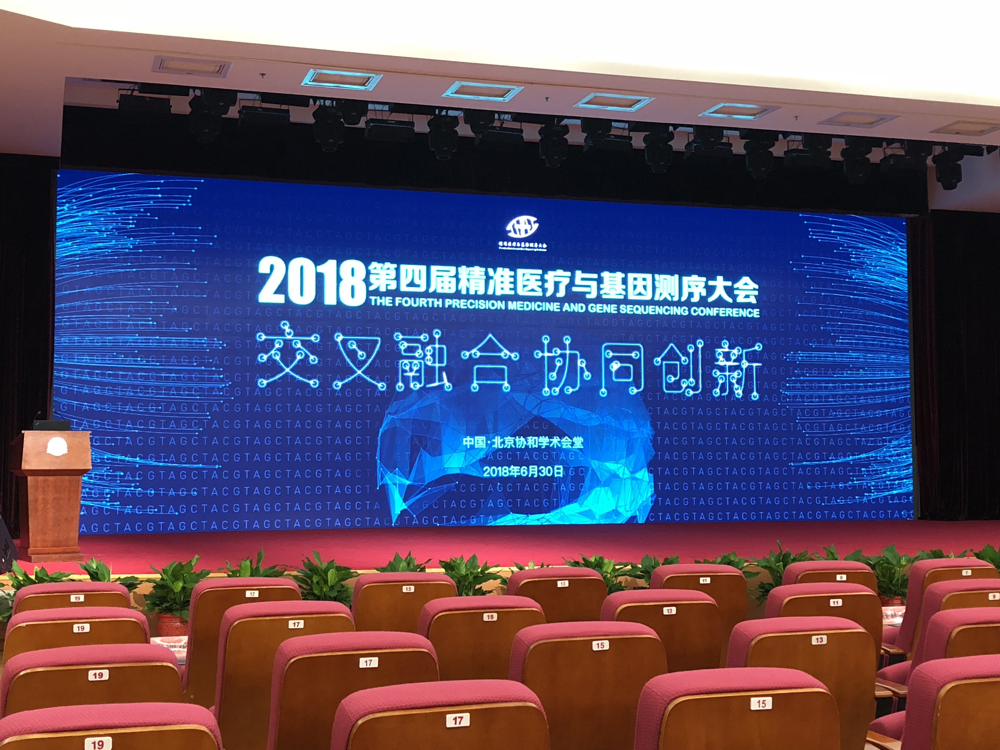

2018第四届精准医疗与基因测序大会
===
---

**写在前面：**
每次开会都很累，因为要听懂每一位学者都报告，需要长时间都注意力集中。但依然乐此不疲，因为确实每次都有不一样的收获。简单总结下这次可以get到的点：
- ppt&如何报告：我一直觉得这是一种能力，需要不断锻炼去提升的，正在逐渐根据学习到都不断强化自己（ppt都很炫，可借鉴都内容、呈现问题的方式、讲解报告的方式等等）；
- 现在前沿都在关注什么？或者说大家都在做什么？基本可以总结为两个点：
	- 肿瘤细胞的治疗已经转向靶向治疗——靶向都方式，CAR-T；
	- ngs各大测序公司现在关注的是如何更快的给出解读报告，以及如何管理这些数据，也就是多层面的大数据管理平台，现在国内已经有公司在做了，而且做的不错。

有一个小的遗憾是没有看到我关注那个公司CEO的报告～

---

- 程京  中国工程院院士

基于社区的各种调查～

中西医并重，预防为主！工作无对错，不探索永远不知道什么是正确的！

精准医疗能否落地，走进百姓的家里是重要的，而不能仅仅只是为富人服务的。

——————

**特邀报告环节**

季加孚  胃癌的精准治疗与科研实践

化疗

靶向治疗

基因检测等等

ppt做的很炫，一些呈现方式值得借鉴。

—————————

詹启敏院士  科技创新与医学进步

———————

张加英  美国纽约纪念斯隆凯特琳癌症中心分子遗传学

————————

钱其军  上海细胞治疗研究院院长  免疫细胞治疗

Car-t治疗：CAR-T，全称是Chimeric Antigen Receptor T-Cell Immunotherapy指的是嵌合抗原受体[T细胞](https://baike.baidu.com/item/T%E7%BB%86%E8%83%9E)免疫疗法。

——————-

张鲲  甲基化检测在癌症早期筛查和诊断中的应用

BSPP技术，靶向技术

——————-

樊荣  单细胞分析解析cart细胞的活性（老师看起来比较nice）

